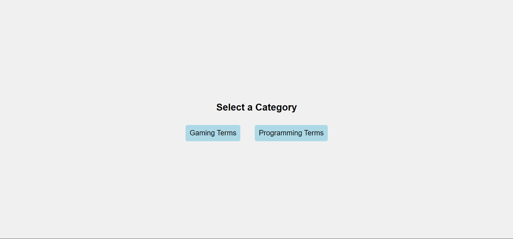
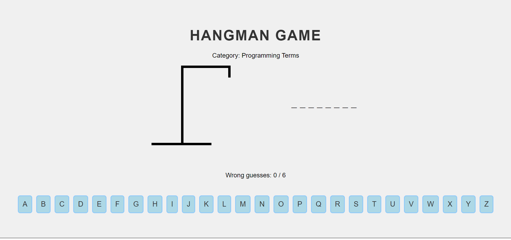
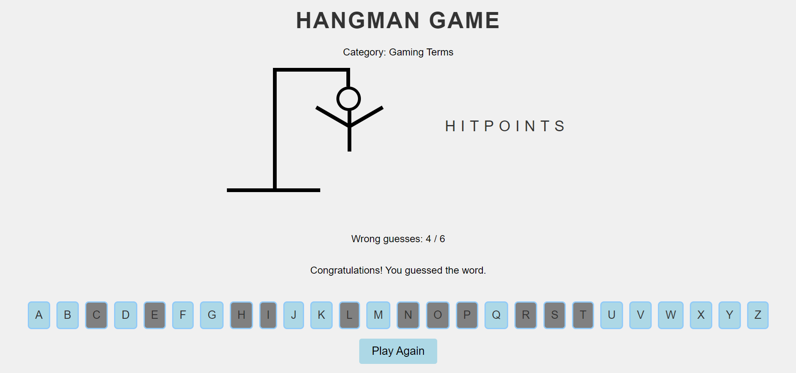

# Hangman Game

This is a web-based Hangman Game built using **React** and **TypeScript**. The game allows users to select between different categories, such as programming terms and gaming terms, and play the classic Hangman game.

## Features

- **Category Selection**: Players can choose between different word categories to start the game.
- **Keyboard Interaction**: Players can guess letters by clicking on the on-screen keyboard or using their physical keyboard.
- **Responsive Design**: The game layout adjusts to various screen sizes for an optimal experience.
- **Dynamic Hangman Drawing**: As incorrect guesses are made, the hangman drawing progresses, eventually leading to a game over if the maximum number of incorrect guesses is reached.

## Categories
Currently, two categories are available:
- **Gaming Terms**
- **Programming Terms**

## Screenshots

### Game Start - Select Category


### Playing the Game - Word Guess


### Game Over


### Victory Screen


## How to Run

1. Clone the repository:
   ```bash
   git clone https://github.com/megamii/Hangman-Game.git
   cd hangman-game
    ```
2. Install dependencies:
    ```bash
    npm install
    ```
3. Run the application:
    ```bash
    npm start
    ```
4. The game will be running on `http://localhost:3000`.

## Technologies Used
- **React**: A JavaScript library for building user interfaces.
- **TypeScript**: A statically typed superset of JavaScript that compiles to plain JavaScript.
- **CSS**: For styling the user interface.

## Future Improvements
- Implement logic to progressively make the game harder as the player successfully guesses words.
- Add a hint feature that provides the definition of the word to assist the player.
- Add more categories with different word lists.
- Implement difficulty levels with fewer or more guesses allowed.
- Improve animations and transitions for a more engaging user experience.